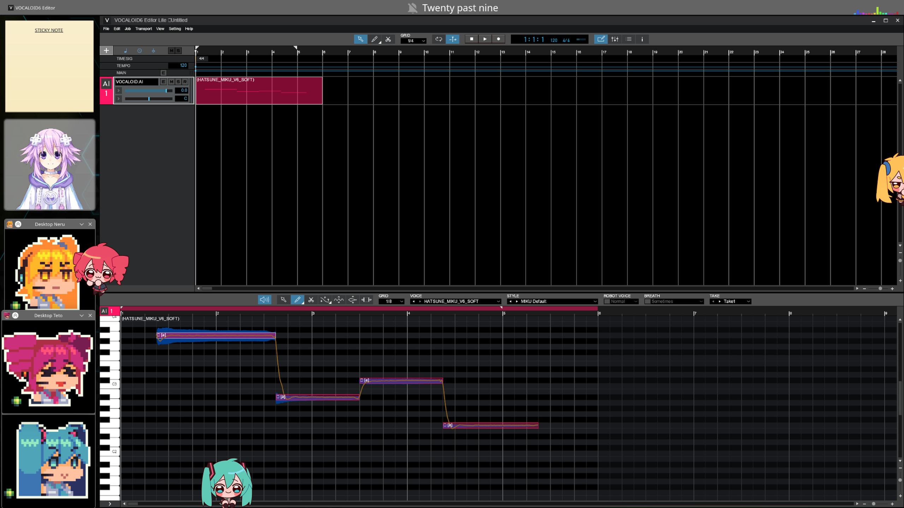

# Vocaloid6 Linux Installer
 Just a script to install Vocaloid6 on Linux. 

 

 Download the script and run it, make sure you have wine, winetricks and yabridge/yabridgectl installed if you want to try and use the VST plugin.

 Before running the script, place the installers for any voices you want installed in ~/V6Voices and the script will install them alongside the editor.
 
 I have not tested this with wine earlier than 11.6. 

*Bash* 
```bash
bash <(curl -s https://raw.githubusercontent.com/eric5949/Vocaloid6-Linux-Installer/refs/heads/main/vocaloid6installer.sh)
```

*Fish* (because I use fish and fish is wierd)
```fish
bash (curl -s https://raw.githubusercontent.com/eric5949/Vocaloid6-Linux-Installer/refs/heads/main/vocaloid6installer.sh | psub)
```

VST works on new wine with this yabridge: https://github.com/robbert-vdh/yabridge/actions/workflows/build.yml?query=branch%3Anew-wine10-embedding
